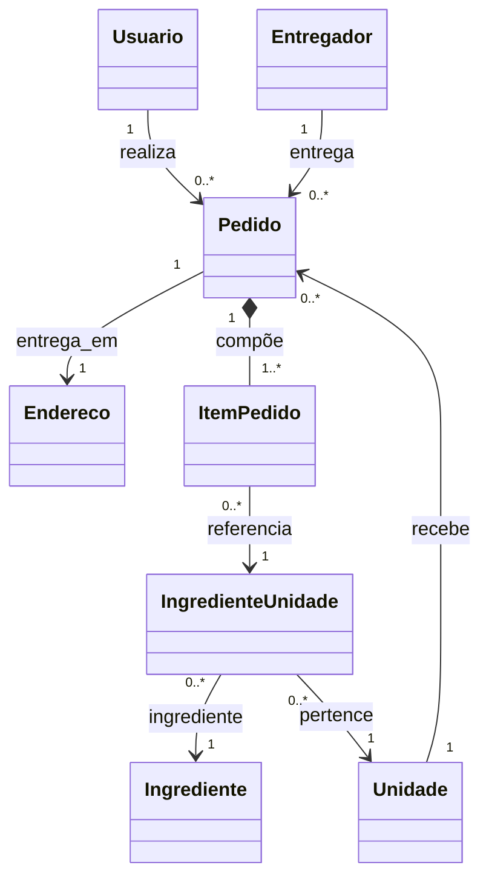
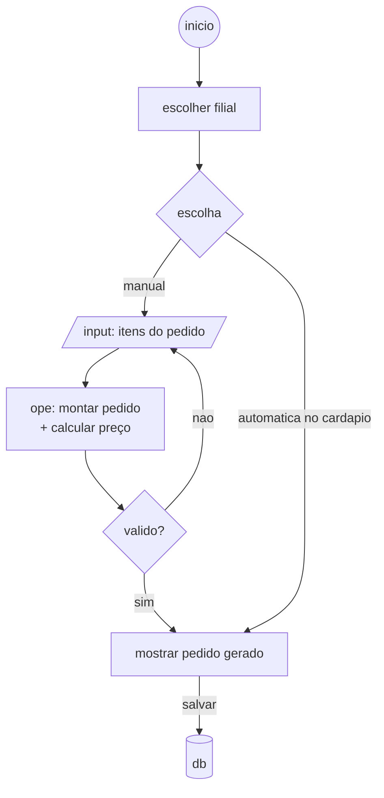
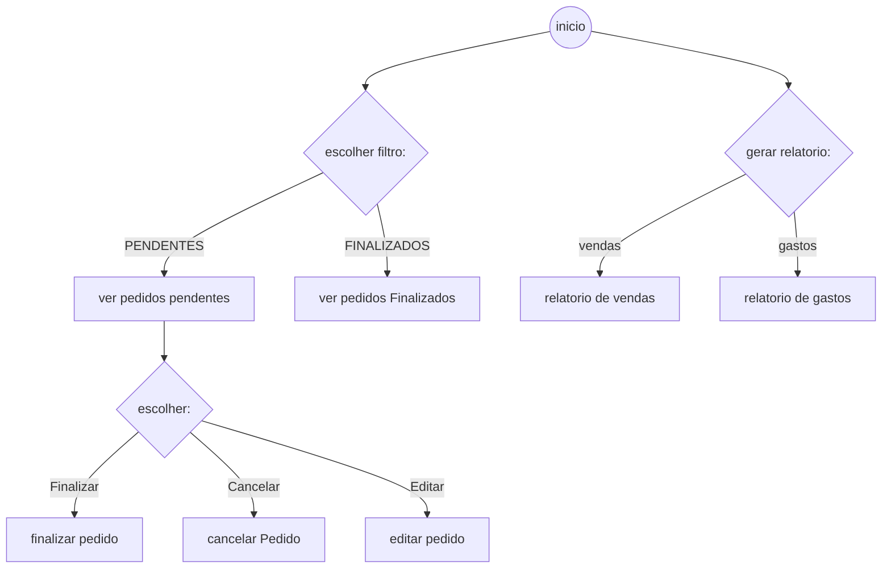

# X TUDO!

> aplicacao para pedir seu x e receber em seu endereco, além de funcionarios receberem os pedidos na lista e processa-los em cada unidade

### Diagrama de classes de dominio

### Fluxo 1 (realização de pedido)

### Fluxo 2 (gerenciamento de pedidos)

