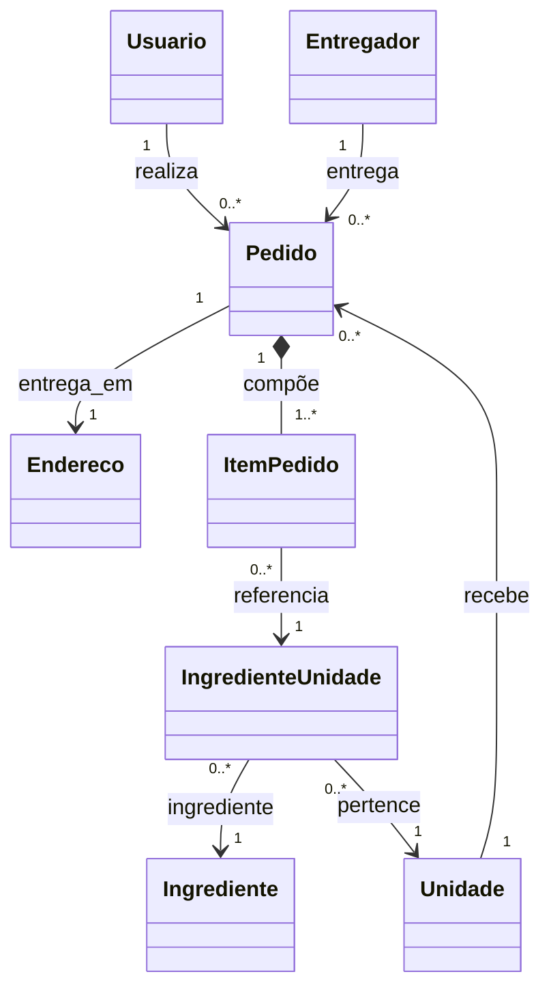

### [voltar](/README.md)

```mermaid
classDiagram

class Usuario
class Unidade
class Endereco
class Pedido
class ItemPedido
class IngredienteUnidade
class Ingrediente
class Entregador

%% Relações principais

Usuario "1" --> "0..*" Pedido : realiza

Unidade "1" --> "0..*" Pedido : recebe

Pedido "1" *-- "1..*" ItemPedido : compõe

ItemPedido "0..*" --> "1" IngredienteUnidade : referencia

IngredienteUnidade "0..*" --> "1" Ingrediente : ingrediente

IngredienteUnidade "0..*" --> "1" Unidade : pertence

Pedido "1" --> "1" Endereco : entrega_em

Entregador "1" --> "0..*" Pedido : entrega

```