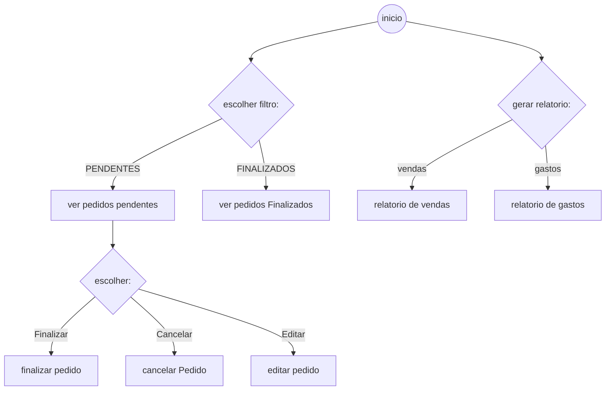

### [voltar](/README.md)

```mermaid
flowchart TB
    id1((inicio)) --> id2{escolher filtro: }
    id2 -- PENDENTES --> id3[ver pedidos pendentes]
    id2 -- FINALIZADOS --> id4[ver pedidos Finalizados]

    id1 --> id5{gerar relatorio: }
    id5 -- vendas --> id6[relatorio de vendas]
    id5 -- gastos --> id7[relatorio de gastos]

    id3 --> id8{escolher: }
    id8 -- Finalizar --> id9[finalizar pedido]
    id8 -- Cancelar --> id10[cancelar Pedido]
    id8 -- Editar --> id11[editar pedido]
```