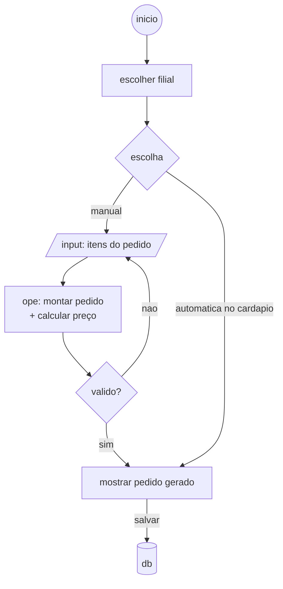

### [voltar](/README.md)

```mermaid
flowchart TB
    id1((inicio)) --> id2[escolher filial]
    id2 --> id3{escolha}

    id3 -- manual --> id4[/input: itens do pedido/]
    id4 --> id5[ope: montar pedido<br/>+ calcular preço]
    id5 --> id6{valido?}

    id6 -- nao --> id4
    id6 -- sim --> id7[mostrar pedido gerado]
    id3 -- automatica no cardapio --> id7
    id7 --> |salvar| id8[(db)]

```
